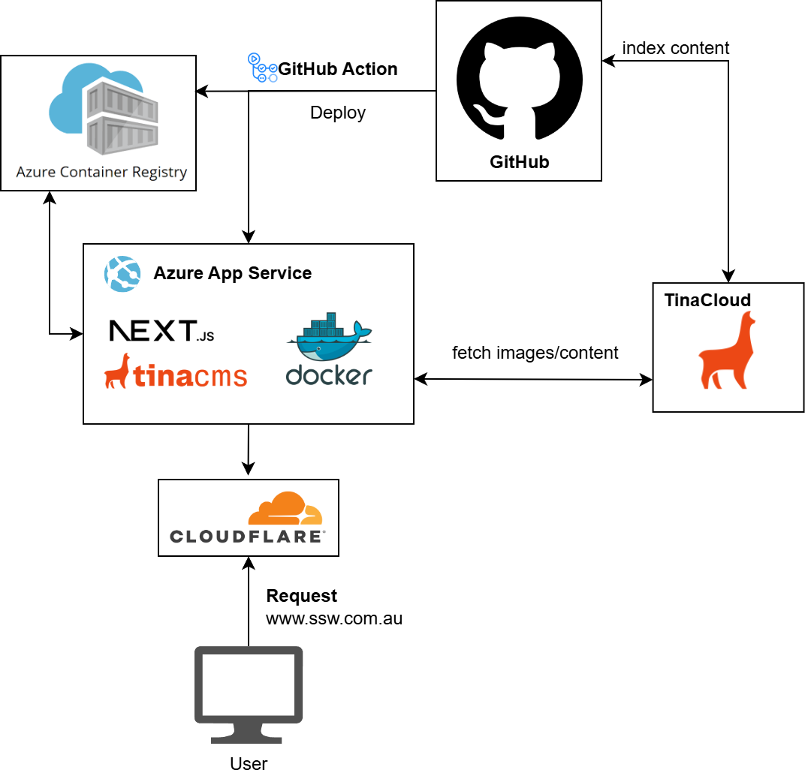

# SSW.Website


This repository is a v3 of the SSW.Website. This website uses NextJS with TinaCMS.


**Watch the demo:**

[](https://www.youtube.com/watch?v=K0WVfM7yCKg)

## See the important Documents

- [Instructions - Deployment](https://github.com/SSWConsulting/SSW.Website/wiki/Instructions---Deployment)
- [Business](https://github.com/SSWConsulting/SSW.Website/wiki/Business)
- [Technologies and Architecture](https://github.com/SSWConsulting/SSW.Website/wiki/Technologies-and-Architecture)
- [Alternative Solutions Considered](https://github.com/SSWConsulting/SSW.Website/wiki/Alternative-Solutions-Considered)
- [Definition of Done](https://github.com/SSWConsulting/SSW.Website/wiki/Definition-of-Done)
- [Definition of Ready](https://github.com/SSWConsulting/SSW.Website/wiki/Definition-of-Ready)
- [SSW Website - Power Automate flows](https://github.com/SSWConsulting/SSW.Website/wiki/Power-Automate-Flows)
- [Application Insights Configuration](_docs/APPLICATION_INSIGHTS.md) - Cost optimization and monitoring configuration

## Architecture Overview



## Requirements

- Git, [Node.js Active LTS](https://nodejs.org/en/about/releases/)
- pnpm `corepack enable pnpm`
- A [TinaCMS](https://app.tina.io) account for live editing.

## Get Started

Install the project's dependencies:

```bash
pnpm install
```

Run the project locally:

```bash
pnpm dev
```

Build the project:

```bash
pnpm build
```

## Build the Docker image locally:

To build the Docker image, execute the following command to extract the necessary Docker build command:

```pwsh
./docker-build-cmd.ps1
```

This script will generate the final Docker build command and automatically copy it to your clipboard. Simply paste the command into your terminal (CMD), and the Docker image build process will commence.

Once the docker image is ready, run the following command:

```bash
 docker run --env-file .env -p 3000:3000 ssw-website
```

⚠️ **Important**: Ensure that all required secrets are present in your .env file and stored in the root directory of your project. Additionally, make sure to update the `NEXT_PUBLIC_TINA_BRANCH` to match the branch you're testing on.

## Get Started with Dev Container

### How to

1. Open Command Palette in VSCode

```vscode
> Dev Containers: Reopen in Container
```

2. Develop as you would normally

### **Don't want to use Dev Container any more?**

1. Close VSCode connected with the Dev Container
2. Open project folder on host machine
3. Remove node_modules and reinstall dependencies

```bash
pnpm install
```

## Updating the project's dependencies

```bash
pnpm outdated
```

Test locally to make sure everything still works.

### Local URLs

- <http://localhost:3000> : browse the website
- <http://localhost:3000/admin> : connect to Tina Cloud and go in edit mode
- <http://localhost:3000/exit-admin> : log out of Tina Cloud
- <http://localhost:4001/altair/> : GraphQL playground to test queries and browse the API documentation

### UI Testing on local

1. Make sure you have `CREATE_LEAD_ENDPOINT` environment variable in your `.env` - [Follow steps to setup](https://github.com/SSWConsulting/SSW.Website/wiki/Accessing-the-Third%E2%80%90Party-APIs-Locally)

2. Run `npx playwright test --ui` in your terminal and make sure your local instance is running in the background.

## Run Lighthouse tests locally

```bash
pnpm lhci autorun
```

It generates report and saves into `.lighthouseci` folder. You can also change the URLs of the pages you want to test in the `.lighthouserc.json` file.

## Pull Requests

Each Pull Request will be deployed to its own staging environment, the URL to the environment is available in the PR thread.

⚠️ **Warning**: Changes in the mdx files must be done with TinaCMS. This is because TinaCMS maps mdx files with its fields with specific characters for customized UI (e.g., rich-text field). So avoid direct edits as they may result in build failures or go unnoticed during PR reviews.

## Getting Help

- [Email SSW](mailto:info@ssw.com.au) to schedule a call.
- Reach out through the chat widget on [ssw.com.au](https://www.ssw.com.au)

- Visit the [documentation](https://tina.io/docs/) to learn about TinaCMS.
- [Join the Tina Discord](https://discord.gg/zumN63Ybpf) to share feedback for TinaCMS to improve.
